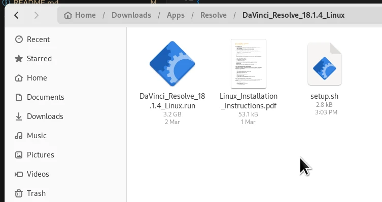
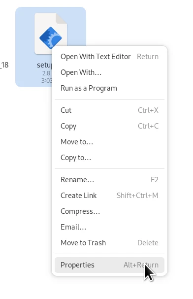
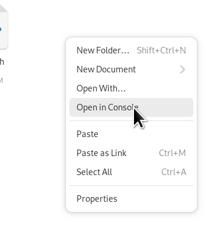
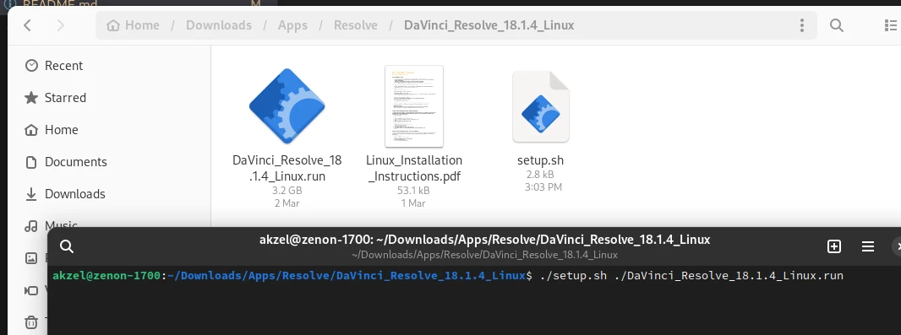

# davincibox

This project aims to provide a ready-to-go container with all of the needed dependencies to install and run DaVinci Resolve on Linux, based on information compiled by bluesabre in his [GitHub Gist](https://gist.github.com/bluesabre/8814afece711b0ca49de34c41e50b296). This is primarily intended for users of image-based systems such as Fedora Silverblue, but can be used on any Linux distro that distrobox is available on.

## Disclaimers

### GPU Support

My own testing for davincibox has exclusively been with an AMD RX 6600XT GPU. However, other users have contributed test results here: [#21](https://github.com/zelikos/davincibox/issues/21)

### DaVinci Resolve Studio

Davincibox has had limited testing with DaVinci Resolve Studio. Use at your own risk. See [#26](https://github.com/zelikos/davincibox/issues/26)

### Codecs

DaVinci Resolve on Linux, especially the free version, has [limited codec support](https://documents.blackmagicdesign.com/SupportNotes/DaVinci_Resolve_18_Supported_Codec_List.pdf?_v=1705996810000). Unless you can show that certain codecs are available when using DaVinci Resolve outside of davincibox, but not when using davincibox, **do not** report issues about missing codecs here.

## Requirements & GPU Information

You will need [Podman](https://podman.io/), as well as [`distrobox`](https://github.com/89luca89/distrobox) or [`toolbox`](https://github.com/containers/toolbox).

You will also need the latest release of DaVinci Resolve from [Blackmagic's website](https://www.blackmagicdesign.com/products/davinciresolve).

If you're less comfortable in the CLI, I recommend using the `setup.sh` script from this repository to help simplify the setup process, but ultimately use of the CLI is a requirement.

Optional: Ensure `lshw` is installed on your system, as `setup.sh` uses it to detect whether you are using an Nvidia GPU or not.

### AMD

AMD uses Mesa's `rusticl` for OpenCL support in DaVinci Resolve, due [various](https://github.com/ROCm/ROCm/issues/768) [issues](https://github.com/zelikos/davincibox/issues/65) with AMD's official option, ROCm. These issues largely stem from the fact that [GPU support in ROCm is very limited](https://rocm.docs.amd.com/projects/install-on-linux/en/latest/reference/system-requirements.html#supported-gpus).

ROCm does remain available as a fallback option:

  - Distrobox: `distrobox enter -n davincibox -- /usr/bin/run-davinci rocm`
  - Toolbox: `toolbox run -c davincibox /usr/bin/run-davinci rocm`

If ROCm does work better for you and you would like to launch Resolve with ROCm automatically, you can also adjust the `DaVinciResolve.desktop` file in `$HOME/.local/share/applications`. Add `rocm` to the end of the `Exec=` line, before `%u`. e.g. `Exec=/usr/bin/toolbox run -c davincibox /usr/bin/run-davinci rocm %u`

### Intel

For Intel GPUs, the `intel-compute-runtime` package is included and used by default.

`rusticl` is available to test as an alternative for Intel users. Similar to running ROCm for AMD as shown above, you can use `run-davinci rusticl` in the container to use `rusticl` instead of the `intel-compute-runtime`:

  - Distrobox: `distrobox enter -n davincibox -- /usr/bin/run-davinci rusticl`
  - Toolbox: `toolbox run -c davincibox /usr/bin/run-davinci rusticl`

### NVIDIA

NVIDIA users will need to install the `nvidia-container-toolkit` on their host OS. If you are using a [Universal Blue](https://universal-blue.org/) image such as [Bluefin](https://projectbluefin.io/), this will already be installed. Otherwise, see [NVIDIA's installation guide](https://docs.nvidia.com/datacenter/cloud-native/container-toolkit/latest/install-guide.html) for instructions for your distribution.

## Setup

### CLI:

Open a terminal, then run `chmod +x /path/to/setup.sh`

Then, `/path/to/setup.sh /path/to/DaVinci_Resolve_versionnumber_Linux.run`

### GUI:

If you're more comfortable in a GUI:

If you're using GNOME, open Files and navigate to where you downloaded the script to. In the example below, the script is in the same folder that I extracted the DaVinci Resolve download to. I recommend you do the same for ease of use, as the rest of the instructions will assume you have done so.



Right-click, and select Properties.



Then, make sure "Executable as Program" is toggled on.


Right-click on an empty spot in the folder. You should see either "Open in Console" as in the screenshot, or "Open in Terminal." Either will be fine.



In the newly-opened terminal window, enter the command below. Replace 'version' with the version of DaVinci Resolve that you are installing (see screenshot for example):

```
./setup.sh ./DaVinci_Resolve_version_Linux.run
```



Then, follow any further prompts in the installation script.

### Manual

First, get davincibox set up.

Distrobox:

**Nvidia users only**, append the `--nvidia` argument to the below command.

```
distrobox create -i ghcr.io/zelikos/davincibox:latest -n davincibox
```

Toolbox:

```
toolbox create -i ghcr.io/zelikos/davincibox:latest -c davincibox
```

On the host, run `--appimage-extract` on your DaVinci Resolve installer

```
/path/to/DaVinci_Resolve_version_Linux.run --appimage-extract
```

Then, run `setup-davinci squashfs-root/AppRun distrobox/toolbox` from within the container

e.g.

Distrobox:

```
distrobox enter davincibox -- setup-davinci squashfs-root/AppRun distrobox
```

Toolbox:

```
toolbox run --container davincibox setup-davinci squashfs-root/AppRun toolbox
```

The suffix at the end is for the `add-davinci-launcher` script. If omitted, setup will still run, but adding the launcher to your application menu won't work.

You can still run `add-davinci-launcher` separately, as either `add-davinci-launcher distrobox` or `add-davinci-launcher toolbox`, depending on what you're using.

After installation completes, you can remove the `squashfs-root` directory.

After setup, run `sudo dnf update` in the container to ensure drivers are up to date:

```
# Distrobox
distrobox enter davincibox -- sudo dnf update

# Toolbox
toolbox run -c davincibox sudo dnf update
```

## Upgrading

Usually, you'll only need to update the packages in the container (i.e. driver updates), not the container image itself. In this case, simply run `sudo dnf update` in davincibox as shown above.

Otherwise, a full upgrade requires re-creating the davincibox container with the newest version of the image. This should only needed if there have been changes to the `setup-davinci` or `add-davinci-launcher` scripts used by davincibox. **When reporting issues, a full upgrade should be performed first**.

If a new version of davincibox is available and you need to upgrade, you can do so manually or with `setup.sh`.

### `setup.sh`

Run `setup.sh upgrade`, then follow the installation steps above.

### Manual

First, run `podman image pull ghcr.io/zelikos/davincibox:latest`

Then, follow the Uninstallation section below and go through manual setup again.

## Uninstallation

Run `./setup.sh remove`, or

Distrobox:

```
# If you are upgrading, you can avoid this line
distrobox enter davincibox -- add-davinci-launcher remove

distrobox stop davincibox
distrobox rm davincibox
```

Toolbox:

```
# If you are upgrading, you can avoid this line
toolbox run --container davincibox add-davinci-launcher remove

podman container stop davincibox
toolbox rm davincibox
```

## Credits

Sean Davis, AKA [bluesabre](https://github.com/bluesabre)
- For putting together [this Gist](https://gist.github.com/bluesabre/8814afece711b0ca49de34c41e50b296); davincibox's Containerfile and setup scripts are heavily based on that information

[Jorge Castro](https://github.com/castrojo) and [Universal Blue](https://github.com/ublue-os)
- Jorge's blog post about [declaring distroboxes](https://www.ypsidanger.com/declaring-your-own-personal-distroboxes/) planted the seed for davincibox to become a thing
- Pretty much everything on the GitHub CI part of this is based on [uBlue's Boxkit](https://github.com/ublue-os/boxkit)
