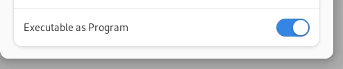

# davincibox

This project aims to provide a ready-to-go container with all of the needed dependencies to install and run DaVinci Resolve on Linux, based on information compiled by bluesabre in his [GitHub Gist](https://gist.github.com/bluesabre/8814afece711b0ca49de34c41e50b296). Davincibox is primarily intended for users of image-based systems such as Fedora Atomic Desktops and Universal Blue images, but it can be used on any Linux distro that distrobox is available on.

## Disclaimers

### GPU Support

My own testing for davincibox has been with an AMD RX 6600XT GPU, an AMD RX 9070 GPU, and an Intel Core Ultra 5 125H (i.e. Intel Arc integrated graphics). Other users have contributed test results here: [#21](https://github.com/zelikos/davincibox/issues/21)

AMD GPUs use ROCm (AMD's official compute package). There have previously been stability issues with using ROCm, but otherwise everything does work. Note that AMD's [official GPU support for ROCm](https://rocm.docs.amd.com/projects/radeon/en/latest/docs/compatibility/native_linux/native_linux_compatibility.html#gpu-support-matrix) is limited, and users of older AMD GPUs (such as the RX 500 series) may not have success with ROCm.

Intel GPUs use `intel-compute-runtime`. No issues have been found so far.

Previously, `rusticl` (via the `mesa-libOpenCL` package) was included as the default for AMD GPUs, but this was found to [break ROCm entirely](https://github.com/zelikos/davincibox/issues/173), and so is no longer included in `davincibox-opencl`.

I do not have an NVIDIA GPU at this time and **cannot** directly troubleshoot issues with using them. Support and troubleshooting for NVIDIA-related issues is very reliant on members of the community.

### DaVinci Resolve Studio

Davincibox has had limited testing with DaVinci Resolve Studio. Use at your own risk. See [#26](https://github.com/zelikos/davincibox/issues/26)

### Codecs

DaVinci Resolve on Linux, especially the free version, has [limited codec support](https://documents.blackmagicdesign.com/SupportNotes/DaVinci_Resolve_19_Supported_Codec_List.pdf?_v=1723705210000). Unless you can show that certain codecs are available when using DaVinci Resolve outside of davincibox, but not when using davincibox, **do not** report issues about missing codecs here.

## Requirements & GPU Information

You will need [Podman](https://podman.io/), as well as [`distrobox`](https://github.com/89luca89/distrobox) or [`toolbox`](https://github.com/containers/toolbox).

You will also need the latest release of DaVinci Resolve from [Blackmagic's website](https://www.blackmagicdesign.com/products/davinciresolve).

If you're less comfortable in the CLI, I recommend using the `setup.sh` script from this repository to help simplify the setup process, but ultimately use of the CLI is a requirement.

**Important**: Ensure `lshw` is installed on your system, as `setup.sh` uses it to detect whether you are using an Nvidia GPU or not. This is pre-installed on Universal Blue images, but you may need to install it yourself on other Linux distributions.

### AMD

AMD uses ROCm, [GPU support is very limited](https://rocm.docs.amd.com/projects/install-on-linux/en/latest/reference/system-requirements.html#supported-gpus) and so it may not work on older AMD GPUs (RX 500 series and prior). If the standard setup instructions do not result in a functional DaVinci Resolve, you can instead try using `rusticl`:

  - Distrobox: `distrobox enter davincibox`
  - Toolbox: `toolbox enter davincibox`

Then, from inside davincibox:

```
sudo dnf install mesa-libOpenCL

# If you exclude the path below, run-davinci defaults to launching DaVinci Resolve.
# If you want to launch one of the other programs included with Resolve,
# use the path to its binary as shown below.
run-davinci -c /path/to/binary
```

If rusticl does work better for you and you would like to launch Resolve with rusticl via the desktop shortcut, you can adjust the `DaVinciResolve.desktop` file in `$HOME/.local/share/applications`.

Change the `Exec=` line as follows:

  - Distrobox: `Exec=distrobox-enter -n davincibox -- /usr/bin/run-davinci -c /opt/resolve/bin/resolve %u`
  - Toolbox: `Exec=/usr/bin/toolbox run -c davincibox /usr/bin/run-davinci -c /opt/resolve/bin/resolve %u`

You can do the same for the other programs that come with DaVinci Resolve, too; just add the `-c` flag after `/usr/bin/run-davinci`.

### Intel

For Intel GPUs, the `intel-compute-runtime` package is included and used by default.

If needed, `rusticl` can also be used via the same instructions in the AMD section above.

### NVIDIA

NVIDIA users will need to install the `nvidia-container-toolkit` on their host OS. If you are using a [Universal Blue](https://universal-blue.org/) image such as [Bluefin](https://projectbluefin.io/), this will already be installed. Otherwise, see [NVIDIA's installation guide](https://docs.nvidia.com/datacenter/cloud-native/container-toolkit/latest/install-guide.html) for instructions for your distribution.

You may additionally need to add a SELinux policy to allow containers to use your GPU. See the "Adding the SELinux policy module" in this [guide](https://www.redhat.com/en/blog/how-use-gpus-containers-bare-metal-rhel-8). Otherwise, you may get an "Unsupported GPU processing mode" error when launching Resolve.

## Setup

### CLI:

Open a terminal, then run `chmod +x /path/to/setup.sh`

Then, `/path/to/setup.sh /path/to/DaVinci_Resolve_versionnumber_Linux.run`

### GUI:

If you're more comfortable in a GUI:

If you're using GNOME, open Files and navigate to where you downloaded the script to. In the example below, the script is in the same folder that I extracted the DaVinci Resolve download to. I recommend you do the same for ease of use, as the rest of the instructions will assume you have done so.


Right-click, and select Properties.


Then, make sure "Executable as Program" is toggled on.



Right-click on an empty spot in the folder. You should see either "Open in Console" as in the screenshot, or "Open in Terminal." Either will be fine.


In the newly-opened terminal window, enter the command below. Replace 'version' with the version of DaVinci Resolve that you are installing (see screenshot for example):

```
./setup.sh ./DaVinci_Resolve_version_Linux.run
```


Then, follow any further prompts in the installation script.

### Manual

#### Setup Davincibox

First, get davincibox set up. There are two different builds of davincibox, depending on whether you use an NVIDIA GPU or not:

**NVIDIA Users**

Distrobox:

```
distrobox create -i ghcr.io/zelikos/davincibox:latest --nvidia -n davincibox
```

Toolbox:

```
toolbox create -i ghcr.io/zelikos/davincibox:latest -c davincibox
```

**Intel & AMD Users**

Distrobox:

```
distrobox create -i ghcr.io/zelikos/davincibox-opencl:latest -n davincibox
```

Toolbox:

```
toolbox create -i ghcr.io/zelikos/davincibox-opencl:latest -c davincibox
```

#### Install DaVinci Resolve

On the host, run `--appimage-extract` on your DaVinci Resolve installer

```
/path/to/DaVinci_Resolve_version_Linux.run --appimage-extract
```

Then, run `setup-davinci squashfs-root/AppRun distrobox/toolbox` from within the container

e.g.

Distrobox:

```
distrobox enter davincibox -- setup-davinci squashfs-root/AppRun distrobox
```

Toolbox:

```
toolbox run --container davincibox setup-davinci squashfs-root/AppRun toolbox
```

The suffix at the end is for the `add-davinci-launcher` script. If omitted, setup will still run, but adding the launcher to your application menu won't work.

You can still run `add-davinci-launcher` separately, as either `add-davinci-launcher distrobox` or `add-davinci-launcher toolbox`, depending on what you're using.

After installation completes, you can remove the `squashfs-root` directory.

After setup, run `sudo dnf update` in the container to ensure drivers are up to date:


Distrobox:

```
distrobox enter davincibox -- sudo dnf update
```

Toolbox:

```
toolbox run -c davincibox sudo dnf update
```

## Upgrading

Usually, you'll only need to update the packages in the container (i.e. driver updates), not the container image itself. In this case, simply run `sudo dnf update` in davincibox as shown above.

Otherwise, a full upgrade requires re-creating the davincibox container with the newest version of the image. This should only needed if there has been a new GitHub release for davincibox, as this may include changes to the `setup-davinci` or `add-davinci-launcher` scripts. **When reporting issues, a full upgrade should be performed first**.

If a new version of davincibox is available and you need to upgrade, you can do so manually or with `setup.sh`.

### `setup.sh`

Run `setup.sh upgrade`, then follow the installation steps above.

### Manual

First, run `podman image pull ghcr.io/zelikos/davincibox:latest`

Then, follow the Uninstallation section below and go through manual setup again.

## Uninstallation

Run `./setup.sh remove`, or

Distrobox:

```
# If you are upgrading, you can avoid this line
distrobox enter davincibox -- add-davinci-launcher remove

distrobox stop davincibox
distrobox rm davincibox
```

Toolbox:

```
# If you are upgrading, you can avoid this line
toolbox run --container davincibox add-davinci-launcher remove

podman container stop davincibox
toolbox rm davincibox
```

## Troubleshooting
### No Audio output
DaVinci Resolve uses ALSA. In `davincibox` this is supported via the `pipewire-alsa` plugin, which re-directs sound to pipewire.
This however requires that the host system provides a pipewire server. If your host-system uses some other sound server, this might not work.

You can either convert your host system to provide `pipewire` or change your `davincibox` instance to use any sound server you have running.

For example, if your host-system uses `pulseaudio`, you can change `davincibox` as follows:

```
> distrobox-enter -n davincibox
> sudo dnf remove pipewire-alsa
> sudo dnf install alsa-plugins-pulseaudio
```

### Resolve Studio crashes on "Checking Licences..."
If you're a user of DaVinci Resolve Studio and have a USB Licence key, some Linux distributions may require you to add a udev rule to enable access to communicate with the USB key from within the container.

An example udev rule is as follows:
```
# Place this file in /etc/udev/rules.d/
# Recommended file name: 90-davinci-usb.rules

SUBSYSTEM=="usb", ATTR{idVendor}=="096e", TAG+="uaccess"

# Allow access to toolbox / distrobox

SUBSYSTEM=="usb", ATTR{idVendor}=="096e", MODE="0664", GROUP="users"
```

### Dual GPU Systems

Davincibox ships with switcheroo-control for handling multi-GPU systems, primarily intended for prioritizing the dedicated GPU over the integrated GPU in laptops. If you have a system with multiple dedicated GPUs, however, you may need to tell switcheroo-control which one to use by default.

Enter davincibox with:

  - Distrobox: `distrobox enter davincibox`
  - Toolbox: `toolbox enter davincibox`

Then, to list the GPUs switcheroo-control detects, run `list-gpus`; this is a wrapper for `switcherooctl list` that includes a needed environment variable for it to work in distrobox.

The output should look something like this:

```
Device: 0
  Name:        Intel Corporation Meteor Lake-P [Intel Arc Graphics]
  Default:     yes
  Environment: DRI_PRIME=pci-0000_00_02_0
```

Use the `Device: #` line to determine the index for the GPU you want switcherooctl to use, then,

`sudo sed -i "s,switcherooctl launch,switcherooctl launch -g #," /usr/bin/run-davinci`

replacing # with the appropriate number determined previously.

## Credits

Sean Davis, AKA [bluesabre](https://github.com/bluesabre)
- For putting together [this Gist](https://gist.github.com/bluesabre/8814afece711b0ca49de34c41e50b296); davincibox's Containerfile and setup scripts were heavily based on that information

[Jorge Castro](https://github.com/castrojo) and [Universal Blue](https://github.com/ublue-os)
- Jorge's blog post about [declaring distroboxes](https://www.ypsidanger.com/declaring-your-own-personal-distroboxes/) planted the seed for davincibox to become a thing
- Pretty much everything on the GitHub CI part of this was originally based on [uBlue's Boxkit](https://github.com/ublue-os/boxkit)
